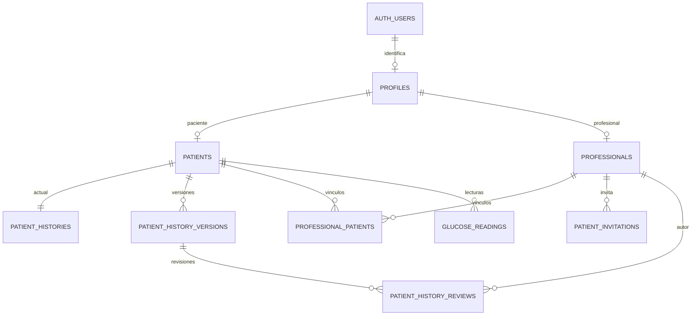

# Arquitectura del acceso y los perfiles

## Modelo implementado para desarrollo

`profiles.user_id` es único y referencia `auth.users`. Los identificadores del usuario, perfil y entidad clínica son distintos. El rol se fija al crear la cuenta; los metadatos editables de Auth solo sirven para prellenar el alta y nunca conceden permisos.

La historia inicial usa un documento JSON validado y tipado. Cada guardado crea una versión inmutable para el cliente. `expected_revision` aplica control de concurrencia y una transacción conserva juntos el estado actual y la versión. El profesional agrega una revisión separada ligada a una versión completada. Una revisión antigua no valida cambios posteriores.

## Permisos

| Actor | Lectura | Escritura |
| --- | --- | --- |
| Anónimo | Sin acceso a las tablas clínicas | Auth administra registro/recuperación; sin escritura clínica |
| Paciente | Perfil e historia propios, versiones, revisiones y profesionales vinculados | Nombre propio, historia mediante RPC, aceptar invitación y finalizar vínculo propio, lecturas propias tras completar historia |
| Profesional | Perfil propio, invitaciones propias, pacientes/historias/lecturas con vínculo activo | Datos profesionales propios, generar invitaciones, notas de revisión mediante RPC, finalizar vínculo propio |
| Backend con service role | Acceso administrativo del servicio | Operaciones de backend y utilidades locales autorizadas |

Todas las tablas públicas creadas tienen RLS. Los privilegios por columna impiden cambiar el rol o reasignar identificadores desde el navegador. Las funciones privilegiadas residen en `private`, fuera de los esquemas expuestos; fijan `search_path` y derivan el actor de `auth.uid()`. Sus envoltorios públicos requieren autenticación.

La invitación utiliza un código aleatorio de 32 caracteres, vence a los siete días y se consume con bloqueo de fila. La vista previa muestra nombre/especialidad/institución antes de aceptar. Un código consumido no vuelve a activar un vínculo finalizado. Se necesita una nueva invitación.

Al finalizar un vínculo, RLS impide nuevas lecturas del profesional sobre ese paciente. Se conservan registros y revisiones previas. El producto no ofrece borrado de cuentas clínicas: las relaciones de autoría requieren diseñar la política institucional de retención antes de incorporar ese flujo.

## Compatibilidad con pantallas existentes

La migración original `001_create_glucose_readings.sql` solo versionaba lecturas, con `patient_id` textual y sin políticas de acceso. La migración `20260924052426_objective_one_access_profiles.sql` agrega la base de perfiles, convierte ese identificador a UUID y agrega relación con pacientes y autoría.

También crea contratos mínimos para `alerts` y `clinical_tasks`, utilizados por las pantallas profesionales que ya existían. RLS limita su consulta a profesionales vinculados y la escritura de tareas al profesional asignado; los cambios de estado se controlan con triggers. Estos contratos mantienen las pantallas disponibles en una instalación nueva. La generación automática de alertas/tareas y los eventos que consumen los workflows todavía requieren el objetivo 3.

## Entorno local

`supabase/config.toml` identifica el proyecto `TrackyGlu`, utiliza los puertos 55320–55329 y configura Auth para localhost:5173. La CLI administra sus contenedores y volúmenes Docker. Los scripts administrativos obtienen sus claves del estado local y verifican que el destino sea localhost/127.0.0.1:55321 antes de crear datos ficticios o ejecutar pruebas.

Las conexiones originales de los workflows se conservaron sin sustituciones. Las credenciales del entorno existente y las del Supabase de desarrollo son configuraciones independientes. El frontend utiliza la clave pública de su destino; las claves administrativas se usan en los scripts/backend correspondientes.

## Preparación del equipo que alojará el proyecto

La migración nueva es una **base para instalación vacía**, ya comprobada con reset local. Antes de aplicarla a una base self-hosted existente:

1. Obtener el esquema y registro de migraciones de esa instancia y una copia de respaldo verificable.
2. Comparar tablas de perfiles, pacientes, profesionales, vínculos y contratos utilizados por los workflows de automatización.
3. Identificar cómo se relacionan los `patient_id` existentes con pacientes. La conversión textual a UUID requiere valores válidos y referencias existentes; la migración de desarrollo no inventa esa correspondencia.
4. Preparar SQL de adaptación que preserve datos, identificadores y conexiones, usando el modelo aprobado.
5. Ensayar ese SQL sobre una copia en Docker y revisar integridad y permisos.
6. Configurar el dominio real en Auth, redirecciones y correo; compilar el frontend con la URL y clave pública de la instancia destino.

No ejecutar `db:reset` sobre una base con datos que se deban conservar. No se ejecutaron migraciones contra el Supabase remoto ni se importaron workflows en n8n durante este objetivo.

El servidor web deberá devolver `index.html` para las rutas del frontend (por ejemplo `/mi-historia`), conservando los archivos estáticos. La configuración concreta de alojamiento se prepara al definir el equipo y dominio finales.

## Ejecución desde SQL Editor

Para una instancia vacía hay una copia consolidada y probada de ambas migraciones en `docs/sql/objetivo-1-supabase.sql`; los pasos están en `docs/sql/README.md`. La copia debe regenerarse si cambia una migración. En una instancia self-hosted con datos se prepara primero un SQL de adaptación específico, no se usa el bootstrap de base vacía.
